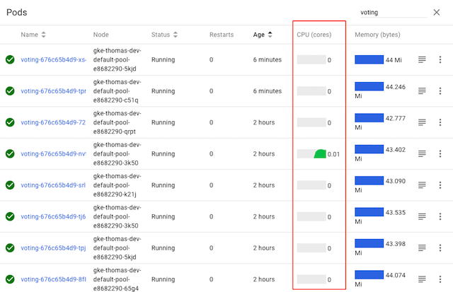
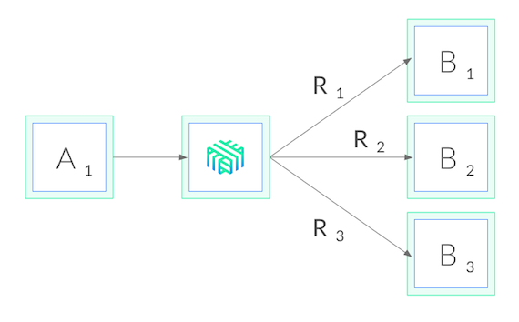
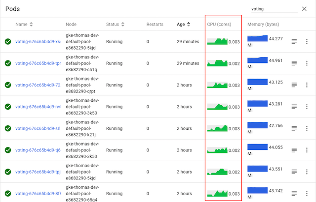
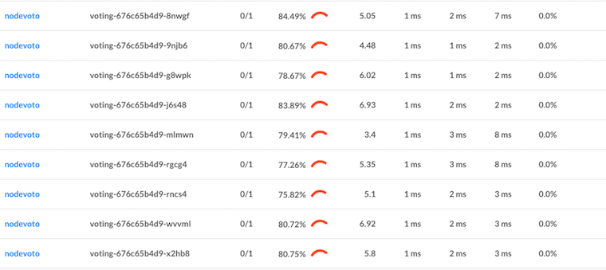

_This is a guest post by [William Morgan](https://linkedin.com/in/wmorgan), Linkerd maintainer._

Many new gRPC users are surprised to find that Kubernetes's default load
balancing often doesn't work out of the box with gRPC. For example, here's what
happens when you take a [simple gRPC Node.js microservices
app](https://github.com/sourishkrout/nodevoto) and deploy it on Kubernetes:

While the `voting` service displayed here has several pods, it's clear from
Kubernetes's CPU graphs that only one of the pods is actually doing any
work&mdash;because only one of the pods is receiving any traffic. Why?

In this blog post, we describe why this happens, and how you can easily fix it
by adding gRPC load balancing to any Kubernetes app with
[Linkerd](https://linkerd.io), a [CNCF](https://cncf.io) service mesh.

# Why does gRPC need special load balancing?

First, let's understand why we need to do something special for gRPC.

gRPC is an increasingly common choice for application developers. Compared to
alternative protocols such as JSON-over-HTTP, gRPC can provide some significant
benefits, including dramatically lower (de)serialization costs, automatic type
checking, formalized APIs, and less TCP management overhead.

However, gRPC also breaks the standard connection-level load balancing,
including what's provided by Kubernetes. This is because gRPC is built on
HTTP/2, and HTTP/2 is designed to have a single long-lived TCP connection,
across which all requests are *multiplexed*&mdash;meaning multiple requests can be
active on the same connection at any point in time. Normally, this is great, as
it reduces the overhead of connection management. However, it also means that
(as you might imagine) connection-level balancing isn't very useful. Once the
connection is established, there's no more balancing to be done. All requests
will get pinned to a single destination pod, as shown below:

# Why doesn't this affect HTTP/1.1?

The reason why this problem doesn't occur in HTTP/1.1, which also has the
concept of long-lived connections, is because HTTP/1.1 has several features
that naturally result in cycling of TCP connections. Because of this,
connection-level balancing is "good enough", and for most HTTP/1.1 apps we
don't need to do anything more.

To understand why, let's take a deeper look at HTTP/1.1. In contrast to HTTP/2,
HTTP/1.1 cannot multiplex requests. Only one HTTP request can be active at a
time per TCP connection. The client makes a request, e.g. `GET /foo`, and then
waits until the server responds. While that request-response cycle is
happening, no other requests can be issued on that connection.

Usually, we want lots of requests happening in parallel. Therefore, to have
concurrent HTTP/1.1 requests, we need to make multiple HTTP/1.1 connections,
and issue our requests across all of them. Additionally, long-lived HTTP/1.1
connections typically expire after some time, and are torn down by the client
(or server). These two factors combined mean that HTTP/1.1 requests typically
cycle across multiple TCP connections, and so connection-level balancing works.

# So how do we load balance gRPC?

Now back to gRPC. Since we can't balance at the connection level, in order to
do gRPC load balancing, we need to shift from connection balancing to *request*
balancing. In other words, we need to open an HTTP/2 connection to each
destination, and balance *requests* across these connections, as shown below:

In network terms, this means we need to make decisions at L5/L7 rather than
L3/L4, i.e. we need to understand the protocol sent over the TCP connections. 

How do we accomplish this? There are a couple options. First, our application
code could manually maintain its own load balancing pool of destinations, and
we could configure our gRPC client to [use this load balancing
pool](https://godoc.org/google.golang.org/grpc/balancer). This approach gives
us the most control, but it can be very complex in environments like Kubernetes
where the pool changes over time as Kubernetes reschedules pods. Our
application would have to watch the Kubernetes API and keep itself up to date
with the pods.

Alternatively, in Kubernetes, we could deploy our app as [headless
services](https://kubernetes.io/docs/concepts/services-networking/service/#headless-services).
In this case, Kubernetes [will create multiple A
records](https://kubernetes.io/docs/concepts/services-networking/service/#headless-services)
in the DNS entry for the service. If our gRPC client is sufficiently advanced,
it can automatically maintain the load balancing pool from those DNS entries.
But this approach restricts us to certain gRPC clients, and it's rarely
possible to only use headless services.

Finally, we can take a third approach: use a lightweight proxy.

# gRPC load balancing on Kubernetes with Linkerd

[Linkerd](https://linkerd.io) is a [CNCF](https://cncf.io)-hosted *service
mesh* for Kubernetes. Linkerd can be applied to a single service&mdash;even without
cluster-wide permissions. When we add Linkerd to our
service, it adds a tiny, ultra-fast proxy to each pod, and these proxies watch
the Kubernetes API and do gRPC load balancing automatically. Our deployment
then looks like this:

Using Linkerd has a couple advantages. First, it works with services written in
any language, with any gRPC client, and any deployment model (headless or not).
Because Linkerd's proxies are completely transparent, they auto-detect HTTP/2
and HTTP/1.x and do L7 load balancing, and they pass through all other traffic
as pure TCP. This means that everything will *just work.*

Second, Linkerd's load balancing is very sophisticated. Not only does Linkerd
maintain a watch on the Kubernetes API and automatically update the load
balancing pool as pods get rescheduled, Linkerd uses an *exponentially-weighted
moving average* of response latencies to automatically send requests to the
fastest pods. If one pod is slowing down, even momentarily, Linkerd will shift
traffic away from it. This can reduce end-to-end tail latencies.

Finally, Linkerd's Rust-based proxies are incredibly fast and small. They
introduce <1ms of p99 latency and require <10mb of RSS per pod, meaning that
the impact on system performance will be negligible.

# gRPC Load Balancing in 60 seconds

Linkerd is very easy to try. Just follow the steps in the [Linkerd Getting
Started Instructions](https://linkerd.io/2/getting-started/)&mdash;install the
CLI on your laptop, install the control plane on your cluster, and "mesh" your
service (inject the proxies into each pod). You'll have Linkerd running on your
service in no time, and should see proper gRPC balancing immediately.

Let's take a look at our sample `voting` service again, this time after
installing Linkerd:

As we can see, the CPU graphs for all pods are active, indicating that all pods
are now taking traffic&mdash;without having to change a line of code. Voila,
gRPC load balancing as if by magic!

Linkerd also gives us built-in traffic-level dashboards, so we don't even need
to guess what's happening from CPU charts any more. Here's a Linkerd graph
that's showing the success rate, request volume, and latency percentiles of
each pod:

We can see that each pod is getting around 5 RPS. We can also see that, while
we've solved our load balancing problem, we still have some work to do on our
success rate for this service. (The demo app is built with an intentional
failure&mdash;as an exercise to the reader, see if you can figure it out by
using the Linkerd dashboard!)

# Wrapping it up

If you're interested in a dead simple way to add gRPC load balancing to your
Kubernetes services, regardless of what language it's written in, what gRPC
client you're using, or how it's deployed, you can use Linkerd to add gRPC load
balancing in a few commands.

There's a lot more to Linkerd, including security, reliability, and debugging
and diagnostics features, but those are topics for future blog posts.

Want to learn more? We’d love to have you join our rapidly-growing community!
Linkerd is a [CNCF](https://cncf.io) project, [hosted on
GitHub](https://github.com/linkerd/linkerd2), and has a thriving community
on [Slack](https://slack.linkerd.io), [Twitter](https://twitter.com/linkerd),
and the [mailing lists](https://lists.cncf.io/g/cncf-linkerd-users). Come and
join the fun!
